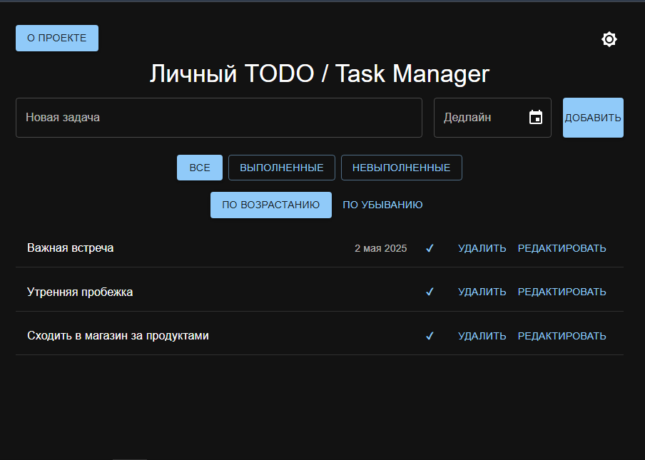

# Личный TODO / Task Manager 📝

[**Посмотреть демо проекта на GitHub Pages →**](https://Azamjon03042001.github.io/personal-todo-app)



Функциональное React-приложение для управления задачами — с дедлайнами, фильтрацией, редактированием и сохранением данных в localStorage.

## Функционал

- Добавление, удаление, редактирование задач
- Фильтрация по статусу (все / выполненные / невыполненные)
- Сортировка по дедлайну (по возрастанию / убыванию)
- Поддержка дедлайна и локализации дат (на русском языке)
- Анимации при добавлении и удалении задач
- Поддержка тёмной и светлой тем
- Сохранение данных в localStorage
- Отзывчивый (адаптивный) интерфейс
- Деплой на GitHub Pages

## Технологии

- **React + Vite**
- **Material UI**
- **Framer Motion**
- **Date-fns**
- **localStorage**
- **Custom Hooks**

## Установка

```bash
git clone https://github.com/Azamjon03042001/personal-todo-app.git
cd personal-todo-app
npm install
npm run dev
```
